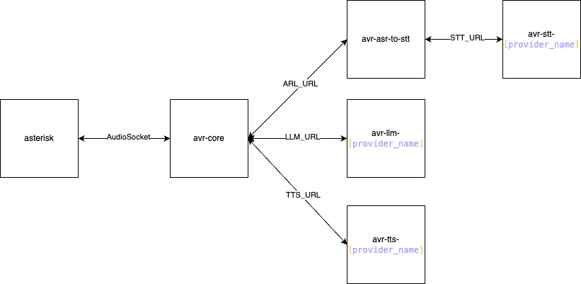

# AVR Speech-to-Text Integration

## Introduction

Currently, Agent Voice Response (AVR) supports ASR, LLM, and TTS modules. The goal of this proposal is to integrate an additional Speech-to-Text (STT) system into the AVR architecture. This integration requires the development of a Voice Activity Detection (VAD) system to manage the interaction between AVR and the STT provider.

## Proposed Architecture



To achieve this integration, we propose developing two new Docker containers:

1. **avr-asr-to-tts**: This container will handle Voice Activity Detection (VAD) and noise filtering. It will process the incoming audio stream, detect speech, and forward only relevant segments to the STT service.

2. **avr-stt-[provider_name]**: This container will be responsible for interfacing with a specific STT provider, converting the processed audio into text, and returning the transcribed text to the AVR core.

## Configuration via Environment Variables

The VAD service (`avr-asr-to-tts`) is configured using environment variables. Create a `.env` file in the root directory of this project (alongside `package.json`) and add the following variables as needed. The service will use default values if a variable is not set in the `.env` file or the system environment.

**Example `.env` file:**

```dotenv
# Server Settings
PORT=6019
STT_URL=http://localhost:6021/transcribe

# VAD Tuning Parameters
VAD_MIN_SPEECH_DURATION_MS=1000
VAD_THRESHOLD=0.2
VAD_MIN_SILENCE_MS=500
VAD_SPEECH_PAD_MS=300

# ONNX Runtime Settings
ONNX_PROVIDER=cpu
# MODEL_FILENAME=silero_vad.onnx # Optional: To specify a different model file
```

### Environment Variable Details

| Variable                      | Default Value                      | Description                                                                                                  |
| :---------------------------- | :--------------------------------- | :----------------------------------------------------------------------------------------------------------- |
| `PORT`                        | `6019`                             | The network port on which the VAD service will listen for incoming audio streams.                            |
| `STT_URL`                     | `http://localhost:6021/transcribe` | The full URL (including endpoint path) of the downstream Speech-to-Text (STT) service.                       |
| `VAD_MIN_SPEECH_DURATION_MS`  | `1000`                             | The minimum duration (in milliseconds) of detected speech required to send the audio segment to the STT service. Segments shorter than this are discarded. |
| `VAD_THRESHOLD`               | `0.2`                              | The sensitivity threshold for the Silero VAD model (typically 0.0 to 1.0). Lower values detect quieter speech more easily but may increase false positives (noise detected as speech). Higher values require louder speech but reduce noise detection. |
| `VAD_MIN_SILENCE_MS`          | `500`                              | The duration of silence (in milliseconds) required after speech before the VAD declares the speech segment ended. |
| `VAD_SPEECH_PAD_MS`           | `300`                              | Padding (in milliseconds) added to the beginning and end of detected speech segments. This helps ensure that the very start and end of words are captured. |
| `ONNX_PROVIDER`               | `cpu`                              | The execution provider for the ONNX Runtime (e.g., `cpu`, `cuda`, `dml`). Determines where the VAD model calculations are performed. |
| `MODEL_FILENAME`              | `silero_vad.onnx`                  | *(Optional)* The filename of the ONNX VAD model to load. If not set, it defaults to `silero_vad.onnx`. The file is expected to be in the same directory as `index.js`. *(Note: Currently, the code loads `silero_vad.onnx` directly, but this variable could be implemented for easier model swapping).* |

### Voice Activity Detection (VAD) Explanation

Voice Activity Detection is the process of identifying the presence or absence of human speech in an audio stream. In this service, we use the Silero VAD model via ONNX Runtime.

-   **Why VAD?** Sending continuous audio (including silence and noise) to a Speech-to-Text service can be inefficient and costly. VAD allows us to:
    -   Isolate only the parts of the audio stream that likely contain speech.
    -   Reduce the amount of data sent to the STT service.
    -   Potentially improve transcription accuracy by removing long silences.
    -   Define logical breaks between utterances.

-   **How it works here:** The `silero_stream.js` processes incoming audio in small chunks (frames). For each frame, the VAD model outputs a probability score indicating the likelihood of speech.
    -   When the probability exceeds `VAD_THRESHOLD`, speech is considered started.
    -   Audio frames are buffered.
    -   When the probability drops below the threshold for a duration defined by `VAD_MIN_SILENCE_MS`, speech is considered ended.
    -   `VAD_SPEECH_PAD_MS` adds a small amount of audio from before the start and after the end to the buffered segment.
    -   If the final segment duration meets `VAD_MIN_SPEECH_DURATION_MS`, it's sent to the `STT_URL`.

## Key Considerations

- **VAD Implementation**: The avr-asr-to-tts container should implement an efficient VAD system that accurately detects speech while filtering out background noise and silence.

- **STT Service Flexibility**: The avr-stt-[provider_name] container should be designed in a modular way, allowing different STT providers to be integrated without major architectural modifications.

- **Compatibility**: Ensure that the system supports multiple STT providers, allowing future integrations without major architectural changes. Define a protocol and parameters to use between avr-asr-to-tts and avr-stt-[provider_name] to standardize communication and ensure interoperability.

- **Scalability**: The architecture should allow for horizontal scaling to handle increased demand efficiently.

- **Latency Optimization**: The system should minimize processing delays to maintain real-time performance.

## Conclusion

This proposed approach enhances AVR's capabilities by introducing a dedicated STT system with a robust VAD mechanism. Implementing these two new containers will ensure a scalable, flexible, and efficient integration of STT providers, paving the way for future enhancements in voice-based AI interactions.

